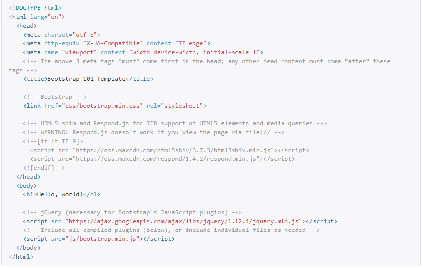

# Componentes y funcionalidad

- Tipo: `lectura`
- Formato: `self-paced`
- Duración: `20min`

***

## Objetivos de Aprendizaje

- Conocer y aprender a usar componentes de frameworks con jQuery

## ¿Componentes con jQuery?

En las lecturas anteriores ya vimos las maravillosas ventajas que nos ofrecen
los frameworks de css... pero aun hay más, los frameworks no solo nos
permiten maquetar y dar estilos más rápido, también tienen algunos
componentes que ya cuentan con la funcionalidad. Esto se logra a través de
**jQuery**.

jQuery es una biblioteca de javascript (que por el momento no nos vamos a
enfocar en entender al 100%), que a través de nuestro framework nos da la
facilidad de agregar nuestra funcionalidad con solo un par de líneas.

Para esto también necesitamos *linkear* en nuestro proyecto el cdn de jQuery
o la ruta de donde se encuentra, si es que descargamos jQuery en nuestro
proyecto.



Ya hecho lo anterior podemos proceder a hacer uso del componente que
necesitemos, para este caso como ejemplo usaremos un **modal**. Antes ya lo
hemos creado con css y javascript, esta vez haremos que la magia salga con
ayuda de nuestro mejor amigo (Sí, el framework que ya decidiste probar...).

Como ya vimos(y practicamos) solo necesitamos ir a la página de nuestro
framework, escoger el modal que más nos hace feliz y copiar el código
necesario, para la funcionalidad copiaremos en nuestro archivo app.js las
líneas que se nos dan ahí mismo.

```html
<button type="button" class="btn btn-primary" data-toggle="modal" data-target="#exampleModal" data-whatever="@mdo">Open modal for @mdo</button>

<div class="modal fade" id="exampleModal" tabindex="-1" role="dialog" aria-labelledby="exampleModalLabel">
  <div class="modal-dialog" role="document">
    <div class="modal-content">
      <div class="modal-header">
        <button type="button" class="close" data-dismiss="modal" aria-label="Close"><span aria-hidden="true">&times;</span></button>
        <h4 class="modal-title" id="exampleModalLabel">New message</h4>
      </div>
      <div class="modal-body">
        <form>
          <div class="form-group">
            <label for="recipient-name" class="control-label">Recipient:</label>
            <input type="text" class="form-control" id="recipient-name">
          </div>
          <div class="form-group">
            <label for="message-text" class="control-label">Message:</label>
            <textarea class="form-control" id="message-text"></textarea>
          </div>
        </form>
      </div>
      <div class="modal-footer">
        <button type="button" class="btn btn-default" data-dismiss="modal">Close</button>
        <button type="button" class="btn btn-primary">Send message</button>
      </div>
    </div>
  </div>
</div>
```

Y en nuestro archivo app.js

```js
$('#myModal').modal('show');
```

Listo!!! Ya podemos probar nuestro modal.

### Y si decidí usar otro framework...

Pues no hay que temer, solo es cuestión de revisar la documentación del
framework que estemos usando, aunque realmente los pasos a seguir son
tremendamente parecidos o hasta los mismos.

Solo es cosa de que no dejemos de practicar, preguntar o investigar y
practicar más.
